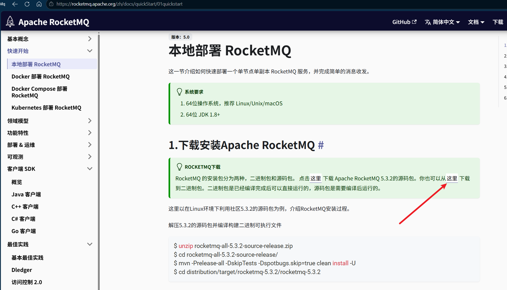
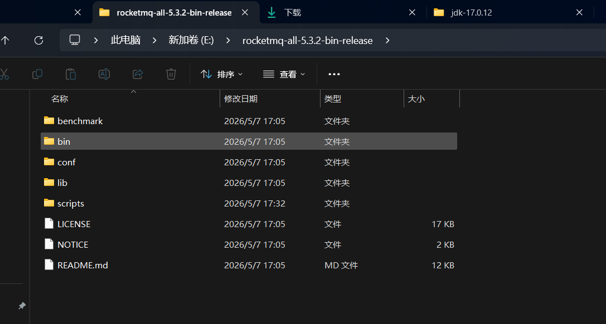
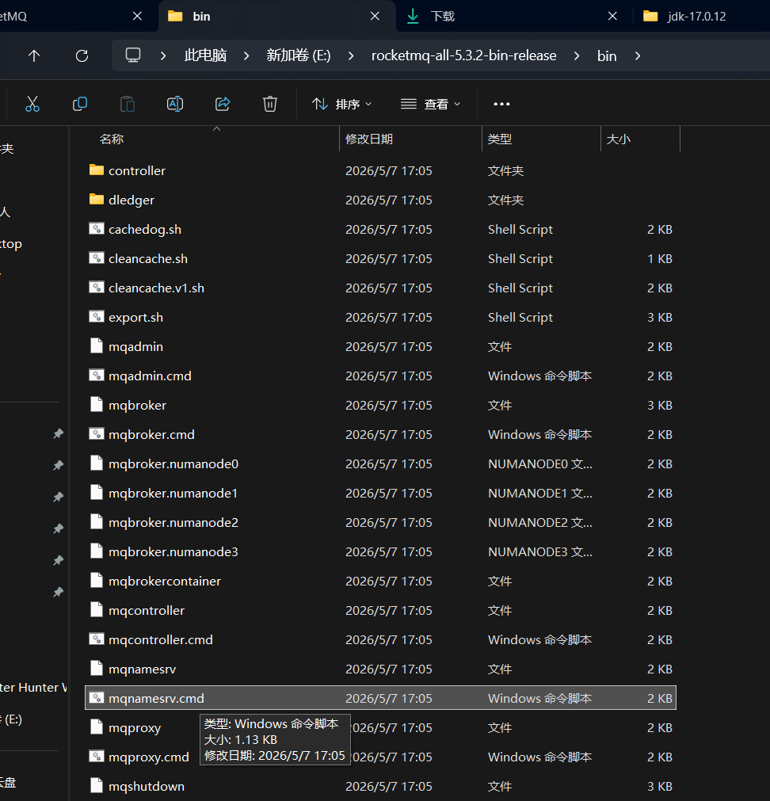
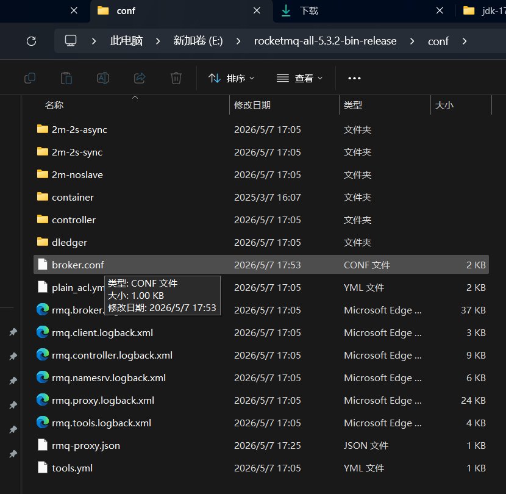

# 2026 Windows环境下 部署rocketMQ 5.3.2

### 下载二进制文件
访问 [rocketMQ 官网](https://rocketmq.apache.org/zh/docs/quickStart/01quickstart)，
点击红色箭头所指处，下载最新的 rocketMQ5.3.2 二进制文件。


本文所下载的版本为[5.3.2版本](https://dist.apache.org/repos/dist/release/rocketmq/5.3.2/rocketmq-all-5.3.2-bin-release.zip)  

### 启动 namesrv
解压下载的zip包，打开解压后文件所在目录


目录结构中，本次部署只涉及两个目录：
1. bin：放置 rocketMQ 各个组件的启动脚本 包括有sh、cmd
2. conf：放置 组件的配置文件

进入到 bin 目录下


双击运行namesrv.cmd，或在控制台中运行命令：
```shell
start namesrv.cmd
```

### 启动 broker
首先配置 broker 的配置文件
进入 conf 目录下，找到 broker.conf 文件


编辑 broker.conf 文件
```text
brokerClusterName=DefaultCluster
brokerName=broker-a
brokerId=0

brokerIP1=127.0.0.1
listenPort=10911

namesrvAddr=127.0.0.1:9876

autoCreateTopicEnable=true

deleteWhen=04
fileReservedTime=48

brokerRole=ASYNC_MASTER
flushDiskType=ASYNC_FLUSH
```

保存然后回到 bin 目录运行 broker.cmd 文件
```shell
start mqbroker.cmd
```


### 启动 proxy
直接双击运行目录下的 proxy.cmd 文件


### 一件启动脚本
这个组件一个个手动启动比较麻烦，可以通过自定义脚本来将namesrv、broker、proxy启动

```shell
@echo off
chcp 65001 >nul
title RocketMQ 5.x Quick Start

REM ==================================================
REM RocketMQ 5.x 一键启动（带探活）
REM 1. 启动 NameServer
REM 2. 探测 9876
REM 3. 启动 Broker
REM 4. 探测 10911
REM 5. 启动 Proxy
REM ==================================================

REM ===== RocketMQ 安装目录 =====
set ROCKETMQ_HOME=E:\rocketmq-all-5.3.2-bin-release

REM ===== Java 环境 =====
set JAVA_HOME=E:\jdk-17.0.12

REM ===== Broker 配置 =====
set BROKER_CONF=%ROCKETMQ_HOME%\conf\broker.conf

REM ===== 控制台颜色 =====
color 0A

echo.
echo ==========================================
echo         RocketMQ 5.x Quick Start
echo ==========================================
echo.

cd /d %ROCKETMQ_HOME%\bin

REM ==================================================
REM 1. 启动 NameServer
REM ==================================================
echo [1/5] 启动 NameServer...

start "RocketMQ-NameServer" cmd /k ^
"mqnamesrv.cmd"

echo 等待 NameServer 就绪...

:CHECK_NAMESRV
netstat -ano | findstr ":9876" >nul

if errorlevel 1 (
    timeout /t 2 >nul
    echo NameServer 未启动，继续等待...
    goto CHECK_NAMESRV
)

echo NameServer 已启动
echo.

REM ==================================================
REM 2. 启动 Broker
REM ==================================================
echo [2/5] 启动 Broker...

start "RocketMQ-Broker" cmd /k ^
"mqbroker.cmd -c %BROKER_CONF%"

echo 等待 Broker 就绪...

:CHECK_BROKER
netstat -ano | findstr ":10911" >nul

if errorlevel 1 (
    timeout /t 3 >nul
    echo Broker 未启动，继续等待...
    goto CHECK_BROKER
)

echo Broker 已启动
echo.

REM ==================================================
REM 创建 Topic
REM ==================================================
echo 创建业务 Topic...

for %%T in (
    order-topic
) do (
    call mqadmin.cmd updateTopic ^
    -n 127.0.0.1:9876 ^
    -c DefaultCluster ^
    -t %%T >nul 2>&1
)

echo Topic 创建完成
echo.

REM ==================================================
REM 3. 额外等待 Broker 注册完成
REM ==================================================
echo 等待 Broker 注册到 NameServer...
timeout /t 10 >nul

REM ==================================================
REM 4. 启动 Proxy
REM ==================================================
echo [3/5] 启动 Proxy...

start "RocketMQ-Proxy" cmd /k ^
"mqproxy.cmd -n 127.0.0.1:9876"

echo.
echo ==========================================
echo RocketMQ 全部启动完成
echo ==========================================
echo.
echo NameServer : 127.0.0.1:9876
echo Broker     : 127.0.0.1:10911
echo Proxy gRPC : 127.0.0.1:8081
echo Proxy HTTP : 127.0.0.1:8080
echo.

pause
```


至此，部署完成

